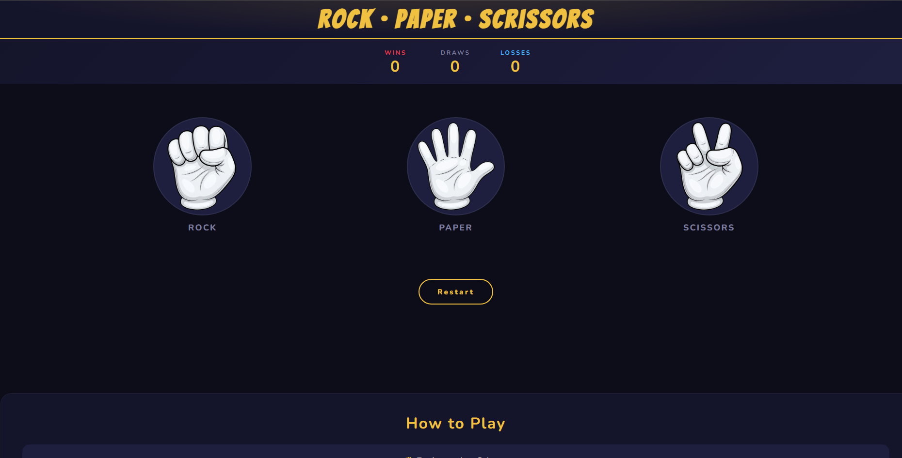

# ✊🖐️✌️ Rock · Paper · Scissors

A clean, responsive single-player Rock Paper Scissors game built with vanilla HTML, CSS, and JavaScript.

---

## Demo

> Open `index.html` in any browser to play.

> [Play Directly here.](https://ashutosht0210.github.io/Rock-Paper-Scissor/)

## 📁 Project Structure

```
rock-paper-scissors/
├── README.md        # Readme file
├── LICENSE          # MIT license agreement
├── index.html       # Main HTML structure
├── style.css        # Styling & responsive layout
├── script.js        # Game logic
└── images/
    ├── rock.png
    ├── paper.png
    └── scissors.png
```

---

## 🎮 How to Play

1. Open `index.html` in any modern browser — no setup needed.
2. Click **Rock**, **Paper**, or **Scissors** to make your move.
3. The computer picks randomly. The result appears instantly below.
4. Scores are tracked live across rounds.
5. Hit **Restart** to reset everything and play again.

### Rules
| Move | Beats |
|------|-------|
| ✊ Rock | ✌️ Scissors |
| 🖐️ Paper | ✊ Rock |
| ✌️ Scissors | 🖐️ Paper |

Same move = 🤝 Draw.

---

## 🛠️ Built With

- **HTML5** — semantic structure
- **CSS3** — custom properties, flexbox, `clamp()` for responsive sizing, transitions & hover effects
- **Vanilla JavaScript** — DOM manipulation, event listeners, random computer choice
- **Google Fonts** — [Bangers](https://fonts.google.com/specimen/Bangers) + [Nunito](https://fonts.google.com/specimen/Nunito)

---

## ✨ Features

- 🏆 Live scoreboard (Wins / Draws / Losses)
- 🎨 Dark theme with gold accents
- 📱 Responsive — works on mobile, tablet, and desktop
- ⚡ No dependencies, no build step — just open and play

---

## Screenshots

> 

## 🚀 Getting Started

```bash
# Clone or download the repo, then just open the file:
open index.html
```

Or drag `index.html` into your browser. That's it.

---

## 📝 Known Issues / Notes

- The `images/` folder must stay in the same directory as `index.html` for the choice images to load correctly.
- Scores reset on page reload (no local storage persistence).

---

## 📄 License

This project is open source and available under the [MIT License](LICENSE).
